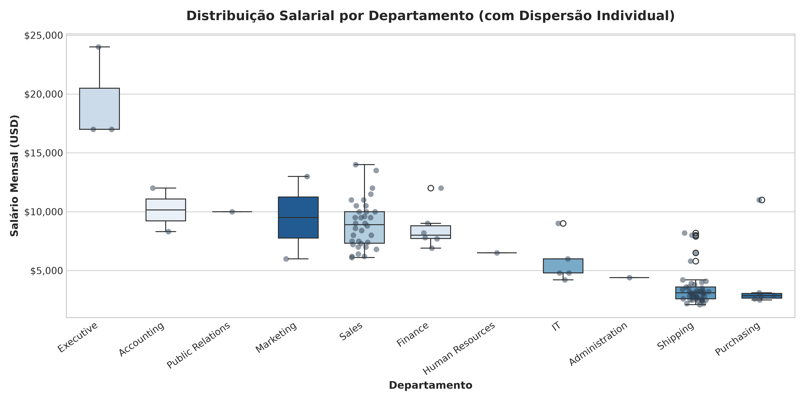
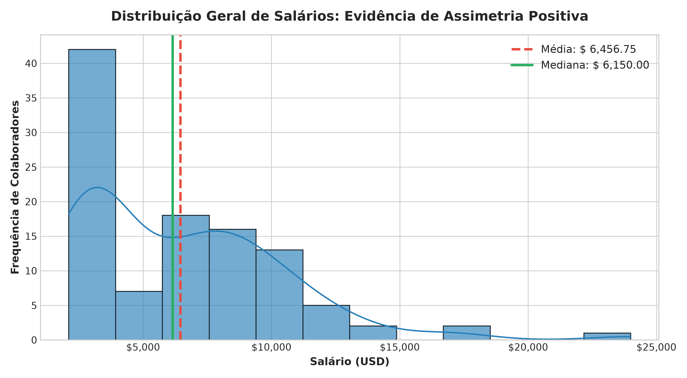
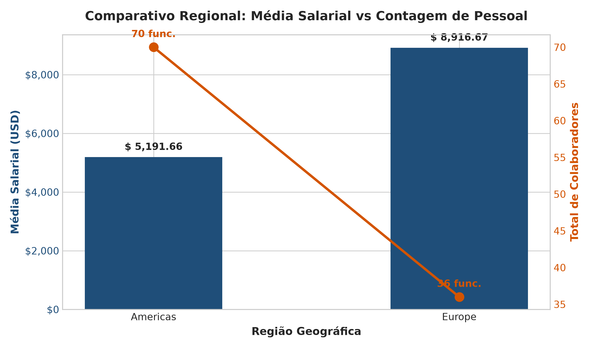
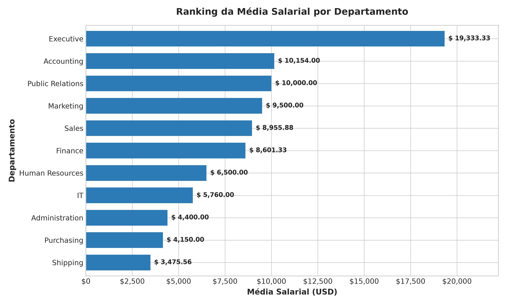

# Projeto de Business Intelligence & Análise de RH (FreeSQL)

**Disciplina:** Visualização de Dados e Business Intelligence [T3]  
**Situação de Aprendizagem:** Projeto Avaliativo - Módulo 1 - Semana 13  
**Aluno:** Amilcar  
**Turma:** [T3]  
**Repositório Oficial:** [amilcarskt/Projeto-Avaliativo-Modulo-1](https://github.com/amilcarskt/Projeto-Avaliativo-Modulo-1)

---

## 1. Objetivo do Trabalho

O objetivo deste projeto é atuar como analista de dados para apoiar a área de Recursos Humanos de uma corporação multinacional na tomada de decisões estratégicas por meio de consultas relacionais em SQL, processamento estatístico em Python e geração de visualizações em Business Intelligence.

A análise busca responder:
1. **Estrutura Salarial e Cargos:** Como os salários se comportam e se distribuem entre diferentes cargos e departamentos? Onde estão concentrados os maiores e menores rendimentos?
2. **Distribuição Geográfica:** Como os funcionários e as faixas de remuneração estão distribuídos geograficamente entre cidades, países e regiões (continentes)?
3. **Comportamento Estatístico (Média vs Mediana):** A curva salarial da empresa é simétrica ou apresenta assimetria induzida por altos cargos executivos (*outliers*)?
4. **Impacto de Filtros de Negócio:** Qual o impacto de cláusulas `WHERE` (ex.: remoção de registros nulos ou corte por faixa salarial) nas métricas e na governança dos dados?

---

## 2. Tabelas Utilizadas (Esquema HR - FreeSQL)

Os dados foram extraídos do banco de dados relacional [FreeSQL](https://freesql.com/) utilizando o esquema **Human Resources (HR)**:

| Tabela | Chave Primária | Descrição no Contexto de RH |
| :--- | :--- | :--- |
| **`HR.EMPLOYEES`** | `EMPLOYEE_ID` | Tabela fato central contendo identificador, nome, salário (`SALARY`), cargo (`JOB_ID`), comissão (`COMMISSION_PCT`), gestor e departamento (`DEPARTMENT_ID`). |
| **`HR.DEPARTMENTS`** | `DEPARTMENT_ID` | Nome do departamento (`DEPARTMENT_NAME`), gestor responsável e chave de localização (`LOCATION_ID`). |
| **`HR.JOBS`** | `JOB_ID` | Título do cargo (`JOB_TITLE`) e limites salariais da função (`MIN_SALARY`, `MAX_SALARY`). |
| **`HR.LOCATIONS`** | `LOCATION_ID` | Endereço, cidade (`CITY`), estado/província (`STATE_PROVINCE`) e chave do país (`COUNTRY_ID`). |
| **`HR.COUNTRIES`** | `COUNTRY_ID` | Nome do país (`COUNTRY_NAME`) e chave da região (`REGION_ID`). |
| **`HR.REGIONS`** | `REGION_ID` | Identificador e nome da região/continente (`REGION_NAME`, ex.: Americas, Europe). |

---

## 3. Resumo das Consultas SQL

As consultas foram construídas com cláusulas **`LEFT JOIN`** para assegurar que nenhum registro de colaborador fosse descartado por ausência pontual de relacionamento em tabelas dimensionais:

### Query 1: Salários por Departamento e Cargo (`sql/query_1.sql`)
- **Objetivo:** Relacionar colaboradores com seus respectivos departamentos e cargos.
- **Relacionamentos:** `HR.EMPLOYEES` com 2 `LEFT JOIN` em `HR.DEPARTMENTS` e `HR.JOBS`.
- **Filtro Aplicado:** `WHERE e.DEPARTMENT_ID IS NOT NULL`.  
  *Justificativa do Filtro:* Elimina colaboradores sem departamento alocado (ex.: Kimberely Grant, ID 178), garantindo que os cálculos departamentais reflitam apenas posições ativas e categorizadas.
- **Arquivo Exportado:** `data/query_01.csv` (106 registros de colaboradores).

```sql
SELECT 
    e.EMPLOYEE_ID AS ID_FUNCIONARIO,
    e.FIRST_NAME || ' ' || e.LAST_NAME AS NOME_FUNCIONARIO,
    e.SALARY AS SALARIO,
    d.DEPARTMENT_NAME AS NOME_DEPARTAMENTO,
    j.JOB_TITLE AS TITULO_CARGO
FROM 
    HR.EMPLOYEES e
LEFT JOIN 
    HR.DEPARTMENTS d ON e.DEPARTMENT_ID = d.DEPARTMENT_ID
LEFT JOIN 
    HR.JOBS j ON e.JOB_ID = j.JOB_ID
WHERE 
    e.DEPARTMENT_ID IS NOT NULL;
```

---

### Query 2: Funcionários por Região e Localização (`sql/query_2.sql`)
- **Objetivo:** Mapear a força de trabalho e os níveis de remuneração em nível de Cidade, Estado, País e Região Continental.
- **Relacionamentos:** `HR.EMPLOYEES` encadeando 4 `LEFT JOIN` com `HR.DEPARTMENTS`, `HR.LOCATIONS`, `HR.COUNTRIES` e `HR.REGIONS`.
- **Filtro Aplicado:** `WHERE r.REGION_NAME IS NOT NULL`.  
  *Justificativa do Filtro:* Garante a completude da hierarquia geográfica até o nível continental.
- **Arquivo Exportado:** `data/query_02.csv` (106 registros de colaboradores).

```sql
SELECT 
    e.EMPLOYEE_ID AS ID_FUNCIONARIO,
    e.FIRST_NAME || ' ' || e.LAST_NAME AS NOME_FUNCIONARIO,
    e.SALARY AS SALARIO,
    d.DEPARTMENT_NAME AS NOME_DEPARTAMENTO,
    l.CITY AS CIDADE,
    l.STATE_PROVINCE AS ESTADO,
    c.COUNTRY_NAME AS PAIS,
    r.REGION_NAME AS REGIAO
FROM 
    HR.EMPLOYEES e
LEFT JOIN 
    HR.DEPARTMENTS d ON e.DEPARTMENT_ID = d.DEPARTMENT_ID
LEFT JOIN 
    HR.LOCATIONS l ON d.LOCATION_ID = l.LOCATION_ID
LEFT JOIN 
    HR.COUNTRIES c ON l.COUNTRY_ID = c.COUNTRY_ID
LEFT JOIN 
    HR.REGIONS r ON c.REGION_ID = r.REGION_ID
WHERE 
    r.REGION_NAME IS NOT NULL;
```

---

## 4. Análise Exploratória de Dados (EDA) em Python

A análise foi implementada tanto em script Python modular (`analise_rh.py`) quanto em Jupyter Notebook interativo (`analise_rh.ipynb`), utilizando as bibliotecas `pandas`, `numpy`, `matplotlib` e `seaborn`.

### 4.1. Medidas Estatísticas Gerais da Base (106 Colaboradores)

| Métrica Estatística | Valor Obtido | Interpretação Prática para o RH |
| :--- | :--- | :--- |
| **Total de Colaboradores** | **106** | Total da força de trabalho com departamento e região válidos. |
| **Média Salarial** | **$ 6.456,75** | Média aritmética de todos os salários. |
| **Mediana Salarial** | **$ 6.150,00** | Ponto central que divide 50% dos salários mais baixos e 50% dos mais altos. |
| **Salário Mínimo** | **$ 2.100,00** | Cargo: *Stock Clerk* (Shipping, South San Francisco). |
| **Salário Máximo** | **$ 24.000,00** | Cargo: *President* (Executive, Seattle). |
| **Amplitude Salarial** | **$ 21.900,00** | Disparidade extrema entre o piso operacional e o topo da presidência. |
| **Desvio Padrão** | **$ 3.927,80** | Elevada variabilidade salarial interna na corporação. |
| **1º Quartil (Q1 - 25%)** | **$ 3.100,00** | 25% da empresa recebe até $ 3.100,00 por mês. |
| **3º Quartil (Q3 - 75%)** | **$ 8.950,00** | 75% da empresa recebe até $ 8.950,00 por mês. |

> **Relação Média vs Mediana (Assimetria Positiva):**  
> Como a **Média ($ 6.456,75)** é significativamente maior do que a **Mediana ($ 6.150,00)**, a distribuição salarial possui **assimetria positiva (à direita)**. Isso prova que uma minoria com altos salários executivos distorce a média para cima. Em decisões de RH (como reajustes e pisos), a **Mediana** é a métrica mais justa e representativa da realidade da maioria.

---

### 4.2. Estatísticas Agrupadas por Departamento

| Departamento | Colaboradores | Média Salarial | Mediana Salarial | Mínimo | Máximo | Desvio Padrão |
| :--- | :---: | :---: | :---: | :---: | :---: | :---: |
| **Executive** | 3 | $ 19.333,33 | **$ 17.000,00** | $ 17.000,00 | $ 24.000,00 | $ 4.041,45 |
| **Accounting** | 2 | $ 10.154,00 | **$ 10.154,00** | $ 8.300,00 | $ 12.008,00 | $ 2.621,95 |
| **Public Relations**| 1 | $ 10.000,00 | **$ 10.000,00** | $ 10.000,00 | $ 10.000,00 | N/A |
| **Marketing** | 2 | $ 9.500,00 | **$ 9.500,00** | $ 6.000,00 | $ 13.000,00 | $ 4.949,75 |
| **Sales** | 34 | $ 8.955,88 | **$ 8.900,00** | $ 6.100,00 | $ 14.000,00 | $ 2.033,68 |
| **Finance** | 6 | $ 8.601,33 | **$ 8.000,00** | $ 6.900,00 | $ 12.008,00 | $ 1.804,13 |
| **Human Resources** | 1 | $ 6.500,00 | **$ 6.500,00** | $ 6.500,00 | $ 6.500,00 | N/A |
| **IT** | 5 | $ 5.760,00 | **$ 4.800,00** | $ 4.200,00 | $ 9.000,00 | $ 1.925,62 |
| **Administration** | 1 | $ 4.400,00 | **$ 4.400,00** | $ 4.400,00 | $ 4.400,00 | N/A |
| **Shipping** | 45 | $ 3.475,56 | **$ 3.100,00** | $ 2.100,00 | $ 8.200,00 | $ 1.488,01 |
| **Purchasing** | 6 | $ 4.150,00 | **$ 2.850,00** | $ 2.500,00 | $ 11.000,00 | $ 3.362,59 |

---

### 4.3. Estatísticas Agrupadas por Região Geográfica

| Região Geográfica | Colaboradores | Média Salarial | Mediana Salarial | Mínimo | Máximo | Desvio Padrão |
| :--- | :---: | :---: | :---: | :---: | :---: | :---: |
| **Europe** | 36 (34,0%) | **$ 8.916,67** | **$ 8.900,00** | $ 6.100,00 | $ 14.000,00 | $ 2.025,20 |
| **Americas** | 70 (66,0%) | **$ 5.191,66** | **$ 3.300,00** | $ 2.100,00 | $ 24.000,00 | $ 4.076,22 |

---

## 5. Visualizações e Interpretação dos Gráficos

### Gráfico 1: Boxplot da Distribuição Salarial por Departamento


* **Interpretação:** O boxplot combinado com pontos de dispersão individual evidencia com clareza o topo isolado do departamento **Executive**, cuja mediana ($ 17.000,00) e máximo ($ 24.000,00) superam em muito qualquer outro setor.
* **Detecção de Disparidades e Outliers:** Em **Purchasing**, a mediana é de apenas $ 2.850,00, mas o gerente da área recebe $ 11.000,00, figurando como um ponto atípico evidente.
* O setor de **Shipping** é o maior empregador (45 pessoas), mas com uma distribuição altamente concentrada na faixa de $ 2.100 a $ 3.600, tendo apenas seus gestores acima de $ 5.800.

---

### Gráfico 2: Histograma com KDE (Média vs Mediana)


* **Interpretação:** O histograma demonstra a concentração da força de trabalho nas faixas salariais de entrada (pico expressivo entre $ 2.000 e $ 4.000).
* **Assimetria Positiva:** A linha vermelha tracejada da **Média ($ 6.456,75)** localiza-se à direita da linha verde sólida da **Mediana ($ 6.150,00)**. Essa assimetria positiva comprova matematicamente que o valor médio é inflacionado pelos diretores e gerentes de alto escalão.

---

### Gráfico 3: Comparativo Regional (Média Salarial vs Quantidade de Colaboradores)


* **Interpretação:** A Europa apresenta uma média salarial consideravelmente maior ($ 8.916,67) que as Américas ($ 5.191,66). 
* **Insight de Negócio:** Essa disparidade reflete a **natureza funcional das operações**: a Europa abriga a equipe de vendas de Oxford (34 especialistas de alto rendimento) e RP na Alemanha, sem posições operacionais de chão de fábrica/logística. As Américas, por sua vez, concentram 45 funcionários de logística/estoque (Shipping) em South San Francisco, o que reduz substancialmente a média geral do continente.

---

### Gráfico 4: Ranking da Média Salarial por Departamento


* **Interpretação:** Exibe a hierarquia corporativa completa dos 11 departamentos ordenados do maior para o menor rendimento médio, facilitando a rápida consulta por gestores e comitês de remuneração.

---

## 6. Como Executar o Projeto Localmente

### Pré-requisitos
- **Python 3.9+** instalado.
- Gerenciador de pacotes `pip`.

### Passo a Passo:
1. **Clone o repositório:**
   ```bash
   git clone git@github.com:amilcarskt/Projeto-Avaliativo-Modulo-1.git
   cd Projeto-Avaliativo-Modulo-1
   ```

2. **Instale as dependências:**
   ```bash
   pip install -r requirements.txt
   ```

3. **Execute o script de análise:**
   ```bash
   python analise_rh.py
   ```
   *As estatísticas serão impressas no console e os gráficos serão salvos na pasta `img/`.*

4. **Para executar o Jupyter Notebook (opcional):**
   ```bash
   jupyter lab
   # ou
   jupyter notebook analise_rh.ipynb
   ```

---

## 7. Sugestões de Melhoria para Versões Futuras

1. **Inclusão da Remuneração Total Variável:** Incorporar o campo `COMMISSION_PCT` para calcular o ganho real dos consultores comerciais de vendas, uma vez que o salário-base subestima o rendimento dessa categoria.
2. **Correção por Paridade de Poder de Compra (PPC):** Ajustar os salários nominais em dólares pelos índices de custo de vida de cada cidade (Seattle, Oxford, Toronto, Munique, Londres).
3. **Dashboard Interativo em Streamlit ou Power BI:** Criar painel dinâmico com filtros interativos por tempo de casa (`HIRE_DATE`), faixa salarial e cargo.
4. **Pipeline Automatizado de ETL:** Integrar consultas diretas ao banco FreeSQL via SQLAlchemy para atualização automática periódica dos arquivos CSV.

---

## 8. Estrutura de Arquivos do Repositório

```text
Projeto-Avaliativo-Modulo-1/
├── data/
│   ├── query_01.csv               # Dados extraídos da Query 1 (106 colaboradores)
│   └── query_02.csv               # Dados extraídos da Query 2 (106 colaboradores)
├── img/
│   ├── boxplot_salarios_departamento.png
│   ├── histograma_distribuicao_salarial.png
│   ├── media_salarial_regiao.png
│   └── media_salarial_departamento.png
├── sql/
│   ├── query_1.sql                # Consulta 1: Salários por departamento e cargo
│   └── query_2.sql                # Consulta 2: Funcionários por região e localização
├── analise_rh.py                  # Script Python completo com EDA e gráficos
├── analise_rh.ipynb               # Jupyter Notebook interativo com análises
├── requirements.txt               # Dependências do projeto
└── README.md                      # Documentação completa do projeto
```
